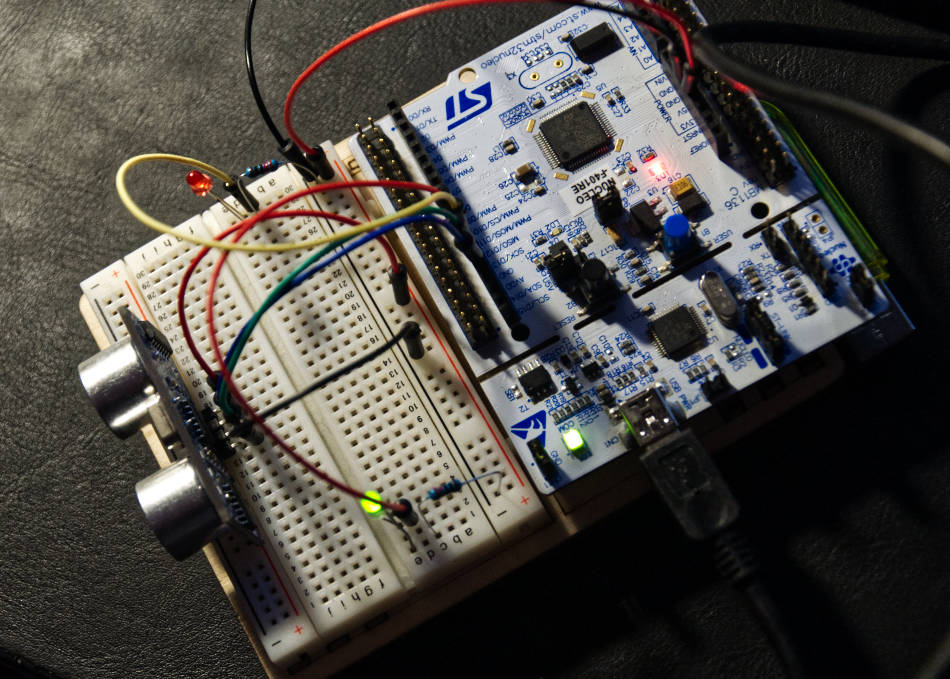

# Distant-STM32F401RE-MCU

Mali projekat je bio baziran na Sparkfun HC-SR04 ultrazvučnom senzoru udaljenosti. Pin 13 smo povezali sa triger pinom senzora, pin 12 sa echo pinom, dok su PWM izlazi 11 i 10 korišćeni za pokretanje dioda. Primer je jednostavan. U zavisnosti od udaljenja objekta menjaju se intenziteti sijanja dioda. Ukoliko je objekat dalje od 24 cm, gori zelena dioda, kako se objekat približava do 10 cm, zelena dioda se polako gasi. Nastavkom približavanja crvena dioda sve više sija, i najzad, kada je predmet bliži od 4 cm, i crvena i zelena dioda blinkaju.

Na serijskom portu se sve vreme ispisuje očitana vrednost udaljenja sa senzora.
